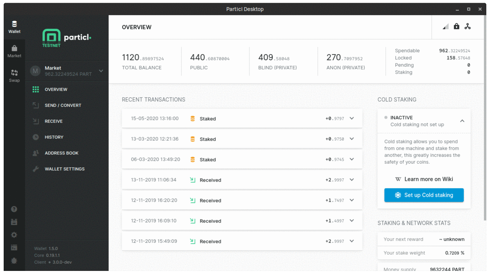
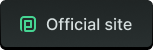

[](https://github.com/particl/particl-desktop/releases/latest)
[](https://github.com/particl/particl-desktop/releases/latest)
[](https://github.com/particl/particl-desktop/releases/latest)

# Particl Desktop



<p align="center">
   <a href="https://github.com/particl/particl-desktop/releases"></a>
   <a href="https://particl.io"></a>
   <a href="https://particl.news"></a>
   <a href="https://particl.wiki"></a>
</p>

**Table of Contents**

* [About](#about)
* [Participate](#participate)
* [Development](#development)
* [Troubleshooting](#troubleshooting)
* [Bug Bounties](#bug-bounties)
* [License](#license)

## About
The [Particl Project](https://particl.io/about) – Striving to protect your rights, freedoms, and privacy.

**Particl Desktop** is a standalone desktop application that hosts multiple functionalities at once and delivers an easy user-experience when interacting with Particl's services and applications. 

Get access to decentralization:

* **Particl Network**<br /> 
The Particl Network consists of two technologies:<br /><br />
   * *Encrypted data exchange protocol*<br />
SecureMessaging (SMSG protocol) is a decentralized storage network (DSN) to store and transfer data between nodes in a privacy-preserving manner. It enables a private and secure environment for e-commerce and communications between users. SMSG powers the Particl Marketplace without bloating the blockchain with excessive data and without leaving any permanent record.
   * *Programmable blockchain with advanced privacy features*<br />
The Particl Blockchain is a decentralized, immutable, and censorship-proof ledger. It is based on bitcoin technology and has been carefully enhanced by the Particl team to provide a more robust level of privacy through industry-leading privacy technologies. Its role within the network is the processing and validation of payments between users without requiring any third-party such as a bank or a payment processor.<br /><br />
* **[Particl Coin](https://particl.io/coin)**<br /> 
PART is a fast and flexible cryptocurrency with multiple privacy states. It lets you send and receive payments without revealing any of your financial data to anyone.
* **[Particl Marketplace](https://particl.io/marketplace)**<br />
Buy and sell anything free of commissions, restrictions, and prying eyes. Payments between participants can be initiated using multiple currencies but always settle in PART. No bank account, documentation, email, phone number, or any other identification type is required but the parties get forced to stay honest with its unique [two-party escrow](https://academy.particl.io/en/latest/in-depth/indepth_escrow.html). Transform today's e-commerce into a free, secure, and trustworthy place, yielding fair market conditions.

Repositories: [Particl Core](https://github.com/particl/particl-core) | [Particl Marketplace](https://github.com/particl/particl-market) 

## Participate

### Chats

* **For developers** The chat [#particl-dev:matrix.org](https://app.element.io/#/room/#particl-dev:matrix.org) using [Element](https://element.io) (formerly Riot).
* **For community** Join the multilingual, open community chat [https://discord.me/particl](https://discord.me/particl) [](https://discord.me/particl) with [Discord](https://discord.com).

[](http://twitter.com/particlproject)
[](http://reddit.com/r/particl)

### Documentation & Installation

For non-developers curious to explore a new world of commerce, binaries can be downloaded and installed. It is the easiest way to get started. Following the guides on [Particl Academy](https://academy.particl.io) is highly recommended. It's the reference book in straightforward language.

[Download](https://github.com/particl/particl-desktop/releases/latest)

## Development

[](https://snyk.io/test/github/particl/particl-desktop)
[](https://travis-ci.org/particl/particl-desktop)
[](https://coveralls.io/github/particl/particl-desktop?branch=master)
[](https://codeclimate.com/github/particl/particl-desktop)
[](https://greenkeeper.io/)

### Requirements

[Node.js®](https://nodejs.org/) v12, [git](https://git-scm.com/), and [yarn](https://yarnpkg.com/en/)

### Development install

NB!! Requires access to the private fork of this repo in order to obtain the latest build changes.

Clone the repo & fetch the dependencies:

```bash
git clone https://github.com/particl/particl-desktop
cd particl-desktop
yarn install
```

> Note: The most recent development happens on the `dev` branch. Keep in mind that the development currently happens on a private fork of this repo. This repository is the user interface that works in combination with our [`particl-core`](https://github.com/particl/particl-core).

In the project's folder:

1. Run `ng serve` to start the dev server and keep it running
1. In another terminal window, run `yarn run start:electron:dev -testnet --devtools` to start Particl Desktop on testnet (the daemon will be updated and launched automatically)
   * `-testnet` – for running on testnet (omit for running the client on mainnet)
   * `-reindex` – reindexes the blockchain (in case you're stuck)
   * `--devtools` – automatically opens Developer Tools on client launch

#### Interact with particl-core daemon

You can directly interact with the daemon ran by the Electron version:

```
./particl-cli -testnet getblockchaininfo
```

### Packaging

#### Windows-only requirements

Building for Windows requires the 32-bit libraries to be available:

```
sudo apt-get install gcc-multilib
sudo apt-get install g++-multilib
```

#### Packaging commands

* `yarn run package:win` – Windows
* `yarn run package:mac` – macOS
* `yarn run package:linux` – Linux


## Troubleshooting

### Development issues

#### Blockchain syncing stuck

Restart the app with `-reindex` flag:

```
yarn run start:electron:dev -testnet --devtools -reindex
```

#### Marketplace fails to load

Delete the marketplace testnet `database` folder and restart the app:

| OS      | path                                                       |
|---------|------------------------------------------------------------|
| Linux   | `~/.particl-market/testnet/03/`                            |
| Windows | `%APPDATA%/Particl Market/testnet/03/`                     |
| macOS   | `~/Library/Application Support/particl-market/testnet/03/` |

### Other issues

See our [Particl Wiki](https://particl.wiki/) for the most common problems or join [#particlhelp:matrix.org](https://app.element.io/#/room/#particlhelp:matrix.org) on [Element](https://element.io) for community help.

## Bug bounties

Particl is a security and privacy oriented project. As such, a permanent bug bounty program is put in place in order to encourage the responsible disclosure of any bug or vulnerability contained within the Particl code and reward those who find them.

[Particl Bug Bounty Program](https://particl.io/bug-bounties/)

## License

Particl Desktop is released under [GNU General Public License v2.0](LICENSE).
