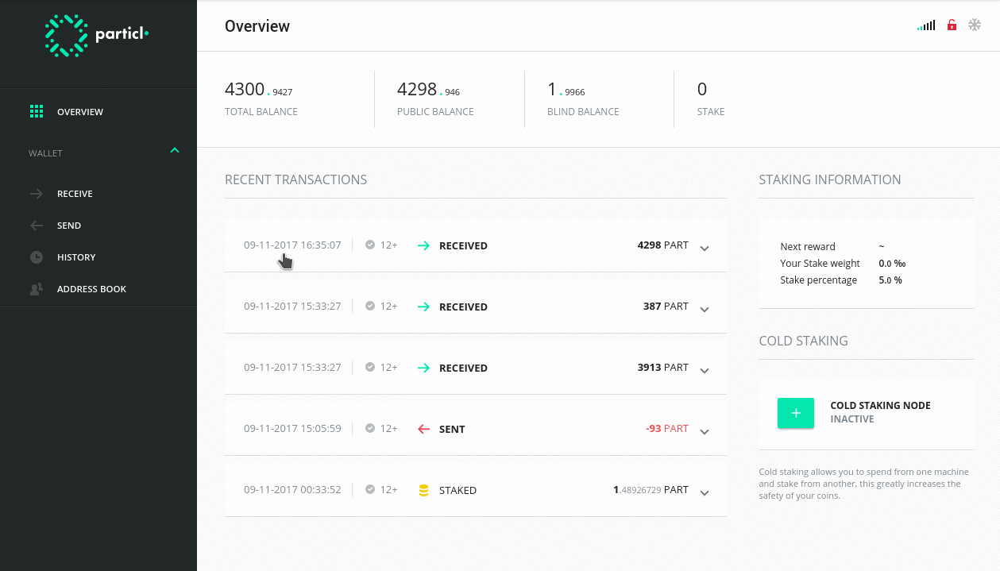

# particl-desktop – UI



> *"Particl is an open source project that aims to restore the balance of privacy on the internet."*

We provide a decentralized privacy platform with a suite of tools to enhance your online privacy:

* **An anonymous cryptocurrency** – send and receive the PART cryptocurrency without revealing the transaction history
* **End-to-end encrypted messaging** – communicate in a secure and decentralized manner without revealing your IP address
* **A private marketplace** – buy and sell goods without leaving a trace

This repository is the user interface that works in combination with our [`particl-core`](https://github.com/particl/particl-core).

[](https://github.com/particl/particl-desktop/releases)

# Contribute

[](https://snyk.io/test/github/particl/particl-desktop)
[](https://travis-ci.org/particl/particl-desktop)
[](https://coveralls.io/github/particl/particl-desktop?branch=master)
[](https://codeclimate.com/github/particl/particl-desktop)
[](https://greenkeeper.io/)

> Be sure to read our [Contributing Guidelines](CONTRIBUTING.md) first

## Development

### Boostrapping for development:

* Download + Install [Node.js®](https://nodejs.org/) 6.4—7.10
* Download + Install [git](https://git-scm.com/)

```bash
git clone https://github.com/particl/particl-desktop
cd particl-desktop
yarn install
```

### Development with Electron

1. Run `ng serve` to start the dev server.
2. Run `yarn run start:electron:dev -testnet -opendevtools` to start the electron application. Daemon will be updated and launched automatically.
   * Note: this command will auto-refresh the client on each saved change
   * `-testnet` – for running on testnet (omit for running the client on mainnet)
   * `-opendevtools` – automatically opens Developer Tools on client launch

#### Interact with particl-core daemon

You can directly interact with the daemon ran by the Electron version.

```
./particl-cli -testnet getblockchaininfo
```

## Running

### Start Electron

* `yarn run start:electron:fast` – disables debug messages for faster startup (keep in mind using `:fast` disables auto-reload of app on code change)

### Package Electron

* `yarn run package:win` – Windows
* `yarn run package:mac` – OSX
* `yarn run package:linux` – Linux

## Contributors

Join us in [#particl-dev:matrix.org](https://riot.im/app/#/room/#particl-dev:matrix.org) on [Riot](https://riot.im)
