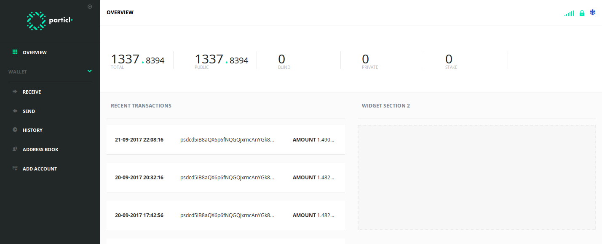

# Particl Wallet



[](https://travis-ci.org/particl/partgui)
[](https://coveralls.io/github/particl/partgui?branch=master)
[](https://codeclimate.com/github/particl/partgui)
[](https://greenkeeper.io/)

> *"Particl is an open source project that aims to restore the balance of privacy on the internet."* 

We provide a decentralized privacy platform with a suite of tools to enhance your online privacy:
* **An anonymous cryptocurrency** - send and receive the PART cryptocurrency without revealing the transaction history
* **End-to-end encrypted messaging** - communicate in a secure and decentralized manner without revealing your IP address
* **A private marketplace** - buy and sell goods without leaving a trace

This repository is the user interface that works in combination with our [`particl-core`](https://github.com/particl/particl-core).

This project was generated with [Angular CLI](https://github.com/angular/angular-cli) version 1.0.0.

## Development

### Boostrapping for development:
* Download + Install [Node.js®](https://nodejs.org/) 6.4 - 7.10
* Download + Install [git](https://git-scm.com/)

```bash
git clone https://github.com/particl/partgui
cd partgui
npm install
```

### Development with Electron
* Run `ng serve` to start the dev server.
* Run `npm run start:electron:dev -- -testnet` in another window to start the electron application.

### Development with a Browser
* Run `ng serve` for a dev server. 
#### Start the particl-core daemon
```
./particld -daemon -testnet -debug -rpcuser=test -rpcpassword=test -rpccorsdomain=http://localhost:4200
```
* Navigate to `http://localhost:4200/`. The app will automatically reload if you change any of the source files.
#### Stop particl-core daemon
```
./particl-cli -rpcuser=test -rpcpassword=test stop
```
#### Interact with particl-core daemon
```
./particl-cli -rpcuser=test -rpcpassword=test getblockchaininfo
```

## Running
### Start Electron
* `npm run start:electron` - Windows

### Package Electron
* `npm run package:win` - Windows
* `npm run package:mac` - OSX
* `npm run package:linux` - Linux

## Contributors
Join us in [#particl-dev:matrix.org](https://riot.im/app/#/room/#particl-dev:matrix.org) on [riot](https://riot.im)
